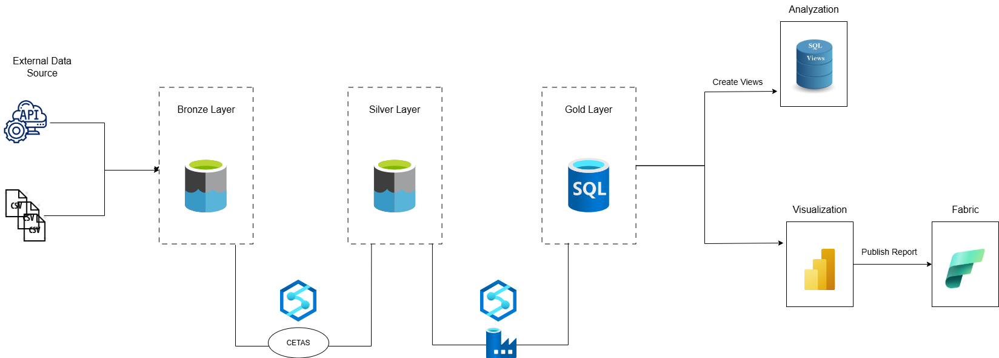

# Customer 360 Data Integration

**GitHub Link:** [ani97/Customer_360_Data_Integration](https://github.com/ani97/Customer_360_Data_Integration)

## Objective

The goal of this project is to build a Customer 360 view by integrating data from multiple sources, including online transactions, in-store purchases, customer service interactions, and loyalty programs. This unified data approach empowers business users to gain valuable insights into customer behavior across different touchpoints, enabling better decision-making.


## Architecture Diagram




## Architecture Summary

### Data Sources

- **APIs:** Real-time transactional or service data.
- **CSV Files:** Historical or batch data for transactions, customers, products, etc.

### Bronze Layer (Raw Data)

- **Storage:** Azure Data Lake Storage (ADLS).
- **Ingestion:** Data from APIs and CSV files ingested and stored in raw format.
- **Purpose:** Preserve original structure for traceability and auditing.

### Silver Layer (Cleaned Data)

- **Technology:** Azure Synapse Analytics.
- **Method:** Transformed and cleaned using CETAS (CREATE EXTERNAL TABLE AS SELECT).
- **Purpose:** Standardize and cleanse data, apply schema enforcement and deduplication.

### Gold Layer (Business-Ready Data)

- **Storage:** Azure SQL Database.
- **Loading:** Processed data from Silver layer aggregated and loaded into SQL tables.
- **Purpose:** Refined data models (fact and dimension tables) for business metrics and reporting.

### Analysis Layer

- **SQL Views:** Generate insights like Average Order Value (AOV), Customer Segmentation, Peak Transaction Times, and Customer Service Metrics.
- **Visualization:** Power BI dashboards published to Microsoft Fabric Workspace for collaboration.

## Steps

### 1. Set Up ADLS, Synapse Workspace, and Containers

- Create Storage Account with Hierarchical Namespace.
- Create `bronze` and `silver` directories for raw and cleaned data respectively.
- Set up Synapse Workspace and link it to the container.

### 2. Load Raw Data in Bronze Layer

- Download datasets from Kaggle.
- Upload CSV files directly to the Bronze layer.

### 3. Transform and Clean Data in Synapse Serverless Pool

- Create external data sources and file formats for both Bronze (CSV) and Silver (Parquet) layers.
- For each CSV file:
    - Create external tables pointing to Bronze data.
    - Use CETAS to write cleaned data to the Silver layer.

### 4. Create Table Schema in Azure SQL Database

```sql
CREATE TABLE Customers (
    CustomerID INT PRIMARY KEY,
    Name VARCHAR(100),
    Email VARCHAR(100),
    Address VARCHAR(255)
);
-- Other table schemas follow similarly for Products, OnlineTransactions, Stores, etc.
```

### 5. Create ADF Pipeline to Copy Data into SQL Database

- Use a **ForEach** activity looping over a JSON schema to map Silver layer folders to SQL tables.
- Configure **Copy Data** activities to transfer Parquet files into SQL tables dynamically.

### 6. Create SQL Views for Analytics

#### View 1 - Average Order Value (AOV)

```sql
CREATE VIEW view1 AS
SELECT COUNT(c.OrderID) AS total_orders, d.Category, b.Location, 
       SUM(a.Amount + c.Amount) AS total_amount
FROM dbo.InStoreTransactions AS a 
INNER JOIN dbo.Stores AS b ON a.StoreID = b.StoreID 
INNER JOIN dbo.OnlineTransactions AS c ON a.CustomerID = c.CustomerID
INNER JOIN dbo.Products AS d ON c.ProductID = d.ProductID
GROUP BY d.Category, b.Location;
```

#### View 2 - Customer Segmentation

```sql
CREATE VIEW view2 AS
WITH online_instore AS (
    SELECT a.CustomerID, COUNT(TransactionID) AS Purchase_freq, SUM(b.Amount) AS Amount
    FROM Customers a
    LEFT JOIN InStoreTransactions b ON a.CustomerID = b.CustomerID
    GROUP BY a.CustomerID
    UNION ALL
    SELECT a.CustomerID, COUNT(OrderID) AS Purchase_freq, SUM(b.Amount) AS Amount
    FROM Customers a
    LEFT JOIN OnlineTransactions b ON a.CustomerID = b.CustomerID
    GROUP BY a.CustomerID
),
total_spend_freq AS (
    SELECT CustomerID, SUM(Purchase_freq) AS TotalPurchaseFrequency, SUM(Amount) AS TotalSpend
    FROM online_instore
    GROUP BY CustomerID
),
loyalty_tier AS (
    SELECT CustomerID, 
           CASE WHEN MIN(CASE WHEN TierLevel = 'Platinum' THEN 1 
                              WHEN TierLevel = 'Gold' THEN 2 
                              WHEN TierLevel = 'Silver' THEN 3 
                              WHEN TierLevel = 'Bronze' THEN 4 
                              ELSE 5 END) = 1 THEN 'Platinum'
                WHEN MIN(CASE WHEN TierLevel = 'Platinum' THEN 1 
                              WHEN TierLevel = 'Gold' THEN 2 
                              WHEN TierLevel = 'Silver' THEN 3 
                              WHEN TierLevel = 'Bronze' THEN 4 
                              ELSE 5 END) = 2 THEN 'Gold'
                WHEN MIN(CASE WHEN TierLevel = 'Platinum' THEN 1 
                              WHEN TierLevel = 'Gold' THEN 2 
                              WHEN TierLevel = 'Silver' THEN 3 
                              WHEN TierLevel = 'Bronze' THEN 4 
                              ELSE 5 END) = 3 THEN 'Silver'
                WHEN MIN(CASE WHEN TierLevel = 'Platinum' THEN 1 
                              WHEN TierLevel = 'Gold' THEN 2 
                              WHEN TierLevel = 'Silver' THEN 3 
                              WHEN TierLevel = 'Bronze' THEN 4 
                              ELSE 5 END) = 4 THEN 'Bronze'
                ELSE NULL END AS TierLevel
    FROM LoyaltyAccounts
    GROUP BY CustomerID
),
spend_ranking AS (
    SELECT tsf.CustomerID, tsf.TotalPurchaseFrequency, tsf.TotalSpend, lt.TierLevel, 
           PERCENT_RANK() OVER (ORDER BY tsf.TotalSpend DESC) AS SpendPercentile
    FROM total_spend_freq tsf
    LEFT JOIN loyalty_tier lt ON tsf.CustomerID = lt.CustomerID
)
SELECT CustomerID, TotalSpend, TotalPurchaseFrequency, TierLevel, 
       CASE WHEN SpendPercentile >= 0.9 THEN 'High-Value Customer' 
            WHEN TotalPurchaseFrequency = 1 THEN 'One-Time Buyer' 
            WHEN TierLevel IS NOT NULL THEN 'Loyalty Champion' 
            ELSE 'Regular Customer' END AS Segment
FROM spend_ranking;
```

#### View 3 - Peak Transaction Times

- **In-Store Transactions:**

```sql
CREATE VIEW instore_view3 AS
SELECT DATENAME(weekday, DateTime) AS DayOfWeek, 
       DATEPART(hour, DateTime) AS HourOfDay, 
       COUNT(*) AS TotalTransactions
FROM dbo.InStoreTransactions
GROUP BY DATENAME(weekday, DateTime), DATEPART(hour, DateTime);
```

- **Online Transactions:**

```sql
CREATE VIEW online_view3 AS
SELECT DATENAME(weekday, DateTime) AS DayOfWeek, 
       DATEPART(hour, DateTime) AS HourOfDay, 
       COUNT(*) AS TotalTransactions
FROM dbo.OnlineTransactions
GROUP BY DATENAME(weekday, DateTime), DATEPART(hour, DateTime);
```

#### View 4 - Customer Service Metrics

```sql
CREATE VIEW view4 AS
SELECT AgentID, COUNT(InteractionID) AS total_interactions, 
       SUM(CASE WHEN ResolutionStatus = 'Resolved' THEN 1 ELSE 0 END) AS resolved,
       CAST(ROUND(
            CASE WHEN SUM(CASE WHEN ResolutionStatus = 'Resolved' THEN 1 ELSE 0 END) = 0 
                 THEN 0 
                 ELSE SUM(CASE WHEN ResolutionStatus = 'Resolved' THEN 1 ELSE 0 END) * 100.0 / COUNT(InteractionID) END, 2) 
            AS DECIMAL(5, 2)) AS success_ratio
FROM dbo.CustomerServiceInteractions
GROUP BY AgentID;
```

### 7. Connect Azure SQL with Power BI

- Use **Get Data > Azure SQL Database** in Power BI.
- Load the tables and views.
- Build visualizations and publish reports to Fabric Workspace.


## SQL Scripts for External Tables and Data Transformation

### External Data Sources and File Formats

```sql
CREATE EXTERNAL DATA SOURCE rawdatapath
WITH (
    LOCATION='https://adlsprojectwork.dfs.core.windows.net/project3/bronze/'
);

CREATE EXTERNAL FILE FORMAT csvformat
WITH (
    FORMAT_TYPE=DELIMITEDTEXT,
    FORMAT_OPTIONS (
        FIELD_TERMINATOR=',',
        STRING_DELIMITER='"',
        FIRST_ROW=2,
        ENCODING='UTF8',
        PARSER_VERSION='2.0'
    )
);

CREATE EXTERNAL DATA SOURCE silverpath
WITH (
    LOCATION='https://adlsprojectwork.dfs.core.windows.net/project3/silver/'
);

CREATE EXTERNAL FILE FORMAT ParquetFormat
WITH (
    FORMAT_TYPE=PARQUET
);
```

### External Tables and CETAS

```sql
CREATE EXTERNAL TABLE agents (
    AgentID INT,
    Name VARCHAR(100),
    Department VARCHAR(100),
    Shift VARCHAR(50)
)
WITH (
    LOCATION='Agents.csv',
    DATA_SOURCE=rawdatapath,
    FILE_FORMAT=csvformat
);
```

#### Write Cleaned Data to Silver Layer

```sql
CREATE EXTERNAL TABLE dbo.silver_agents
WITH (
    LOCATION='Agents/',
    DATA_SOURCE=silverpath,
    FILE_FORMAT=ParquetFormat
)
AS
SELECT AgentID,
       ISNULL(Name, 'Unknown') AS Name,
       ISNULL(Department, 'NA') AS Department,
       ISNULL(Shift, 'NA') AS Shift
FROM agents
WHERE AgentID IS NOT NULL;

-- Validate the data
SELECT * FROM dbo.silver_agents;
```
